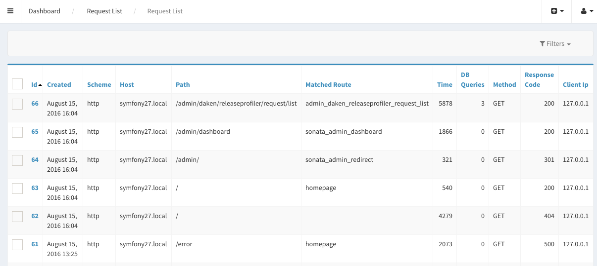
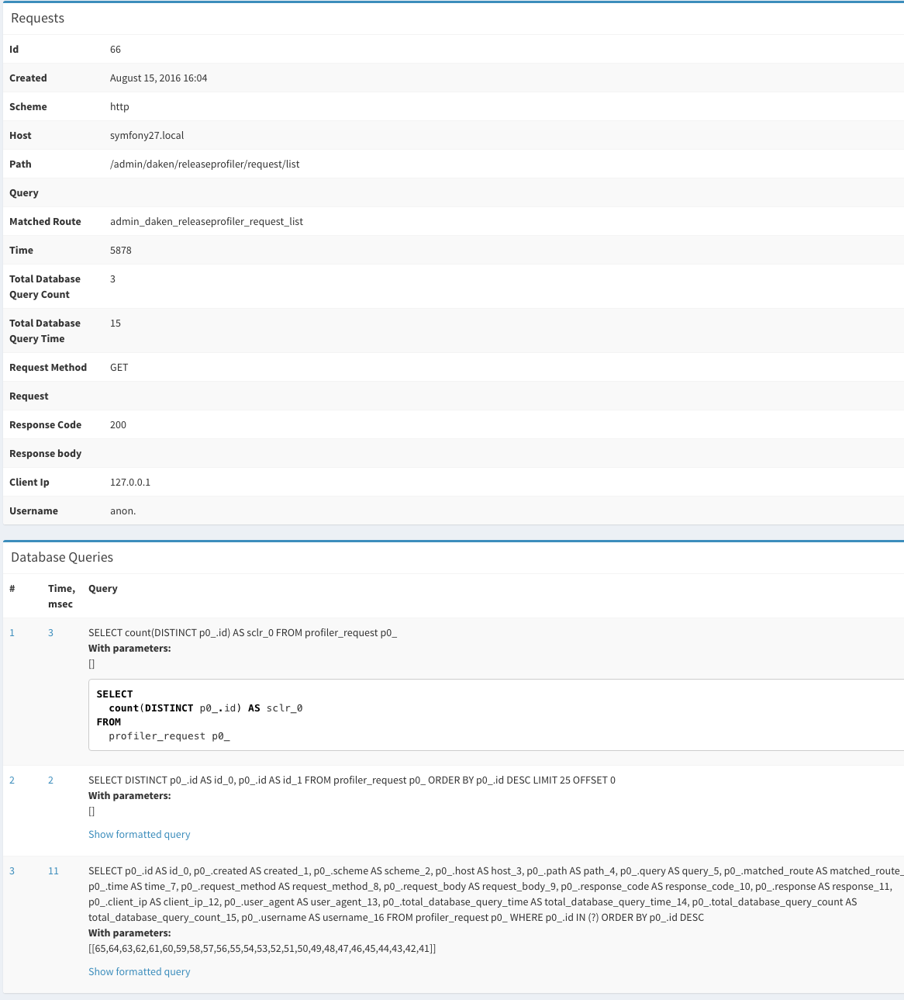

Introduction
============

This bundle allows you to log all requests and responses from your symfony applications, post all errors to slack 
immediately and see what database queries happened on those requests.

It also shows you full stack trace of all logged database queries. If you use SonataAdminBundle you can easily show
 and filter requests, queries and errors.

On each request this bundle creates Daken\ReleaseProfilerBundle\Request object, checks if it should be persisted with
log_conditions.request configuration array. If any error occurred, it is added to request and posted to Slack or your 
custom notifier.

Each database query is appended to request too. You can configure database_query_time_log_threshold parameter so
it will log only queries that last longer than specific time.

When kernel terminates, Request object is passed to configured PersistManager. It can be redis, database or your own 
service that implements PersistManagerInterface. When redis is used, Request object is serialized and pushed to queue 
in redis. After that it is persisted to database using `daken:profiler:flush` command.

Using redis is strongly recommended as it won't add significant overhead to each of your requests.

Installation
============

Step 1: Download the Bundle
---------------------------

To install :

    $ composer require dakenf/release-profiler-bundle "~1"

Step 2: Enable the Bundle
-------------------------

Then, enable the bundle by adding it to the list of registered bundles
in the ``app/AppKernel.php`` file of your project:

    <?php
    // app/AppKernel.php

    class AppKernel extends Kernel
    {
        public function registerBundles()
        {
            $bundles = array(
                // ...
                new Daken\ReleaseProfilerBundle\DakenReleaseProfilerBundle(),
                // ...
            );
        }
    }

.. _`installation chapter`: https://getcomposer.org/doc/00-intro.md

Step 3: Configuration
-------------------------
Usage scenario 1: 
Log only errors to database and post to slack without redis

In this case you should define another entity manager for this bundle because when doctrine gets any database error
 while working with EM, it closes it permanently. So code won't able to persist request data.

    # app/config.yml
    
    doctrine:
        orm:
            auto_generate_proxy_classes: "%kernel.debug%"
            default_entity_manager: default
            entity_managers:
                default:
                    connection: default
                    mappings:
                        AppBundle: ~
                # this is our second entity manager. it can use same connection
                profiler:
                    connection: default
                    mappings:
                        DakenReleaseProfilerBundle: ~
    
    daken_release_profiler:
        persist_manager: database
        entity_manager: doctrine.orm.profiler_entity_manager # here we have our custom entity manager
        
        log_conditions:
          request:
            - { exclude: true, error: 'Symfony\Component\HttpKernel\Exception\NotFoundHttpException' }
            - { error: true }
          request_body:
            - { error: true }
          response_body:
            - { error: true }
    
        enable_sonata: true
        error_notifier: slack
        slack:
            hook_url: %your_custom_slack_hook_url_parameter%
            username: Rage bot
            emoji: ":rage4:"

Usage scenario 2: 
Log only errors to database and post to slack without redis. But also log all requests and responses on API host.

    # app/config.yml
    
    doctrine:
        orm:
            auto_generate_proxy_classes: "%kernel.debug%"
            default_entity_manager: default
            entity_managers:
                default:
                    connection: default
                    mappings:
                        AppBundle: ~
                # this is our second entity manager. it can use same connection
                profiler:
                    connection: default
                    mappings:
                        DakenReleaseProfilerBundle: ~
    
    daken_release_profiler:
        persist_manager: database
        entity_manager: doctrine.orm.profiler_entity_manager # here we have our custom entity manager
        
        log_conditions:
          request:
            - { exclude: true, error: 'Symfony\Component\HttpKernel\Exception\NotFoundHttpException' }
            - { error: true }
            - { host: "%api_host%" }
          request_body:
            - { error: true }
            - { host: "%api_host%" }
          response_body:
            - { error: true }
            - { host: "%api_host%" }
    
        enable_sonata: true
        error_notifier: slack
        slack:
            hook_url: %your_custom_slack_hook_url_parameter%
            username: Rage bot
            emoji: ":rage4:"

Usage scenario 3:
Log all requests except 404, save request and response body only on API host. Use redis with SncRedisBundle 
to save request data. Exclude sonata admin and symfony debug toolbar requests. 
Log database queries that last longer than 50 msec.

    # app/config.yml

    daken_release_profiler:
        persist_manager: redis
        redis:
          service: "snc_redis.default"
        log_conditions:
          request:
            - { exclude: true, error: 'Symfony\Component\HttpKernel\Exception\NotFoundHttpException' }
            - { exclude: true, path_preg: "#^/admin#"}
            - { exclude: true, route: "_wdt"}
            - { exclude: true, route: "_profiler"}
            - { always: true }
          request_body:
            - { host: "%api_host%" }
            - { error: true }
          response_body:
            - { host: "%api_host%" }
            - { error: true }
    
        enable_sonata: true
        database_query_time_log_threshold: 50
        error_notifier: slack
        slack:
            hook_url: %your_custom_slack_hook_url_parameter%
            username: Rage bot
            emoji: ":rage4:"
    
You might also want to add roles for your users that should be able to see profiler data

    # app/securtiy.yml
    ROLE_SOME_USER:
        - ROLE_DAKEN_RELEASE_PROFILER_ADMIN_REQUEST_LIST
        - ROLE_DAKEN_RELEASE_PROFILER_ADMIN_REQUEST_VIEW
        - ROLE_DAKEN_RELEASE_PROFILER_ADMIN_ERROR_LIST
        - ROLE_DAKEN_RELEASE_PROFILER_ADMIN_ERROR_VIEW
        - ROLE_DAKEN_RELEASE_PROFILER_ADMIN_DATABASE_QUERY_LIST
        - ROLE_DAKEN_RELEASE_PROFILER_ADMIN_DATABASE_QUERY_VIEW
        
Step 4: Crating database tables
------------------------------

If you have defined another entity manager for profiler and now want to get SQL queries to create tables
you should add `--em=profiler` to command, where profiler is entity manager's name.
    
    $ php app/console doctrine:schema:update --dump-sql --em=profiler
    
or

    $ php app/console doctrine:migrations:diff --em=profiler

        
Step 5: Running flush command
------------------------------

This step is needed only when you use redis as persist manager.

You should consider using redis because database persist manager will add overhead to each of your requests, 
however on small projects it won't have big impact.

You can run flush command with cron or start it as a service.

    $ php app/console daken:profiler:flush -d --silent

-d runs it as a daemon

--silent surpasses all output

--wait-seconds sets amount of seconds to make blocking request to redis. This timeout is used in daemon mode, to make 
code wait until there is new request in redis queue. If you use SncRedisBundle and phpredis, make sure that your redis connection config timeout is set 
to a value greater than this. Otherwise you will get RedisException with timeout.

